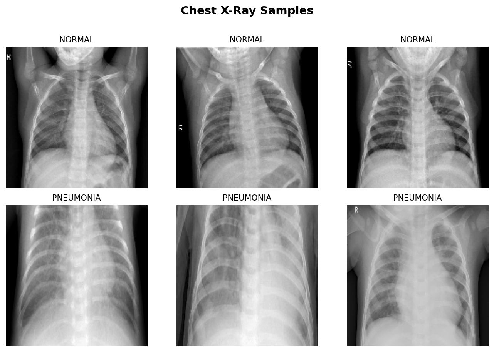
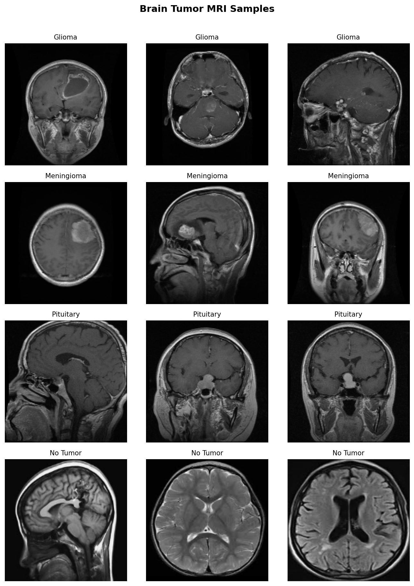
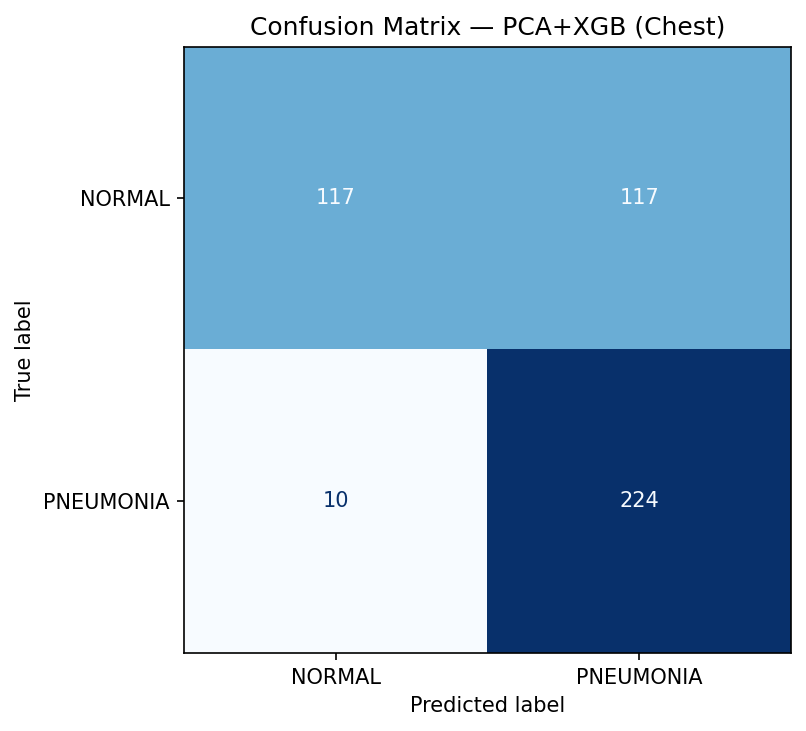
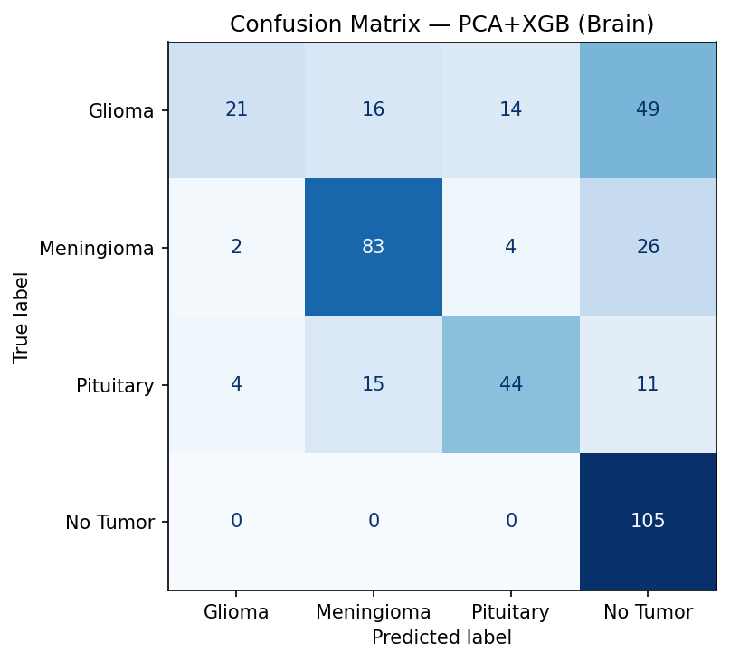
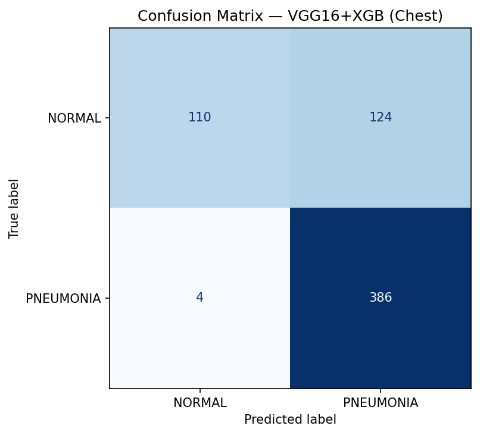
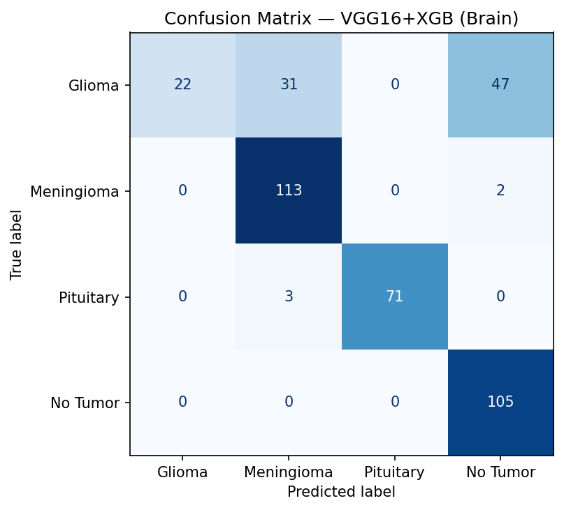
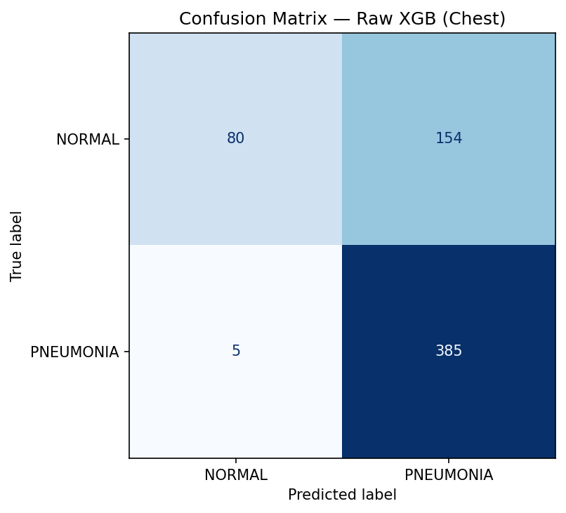
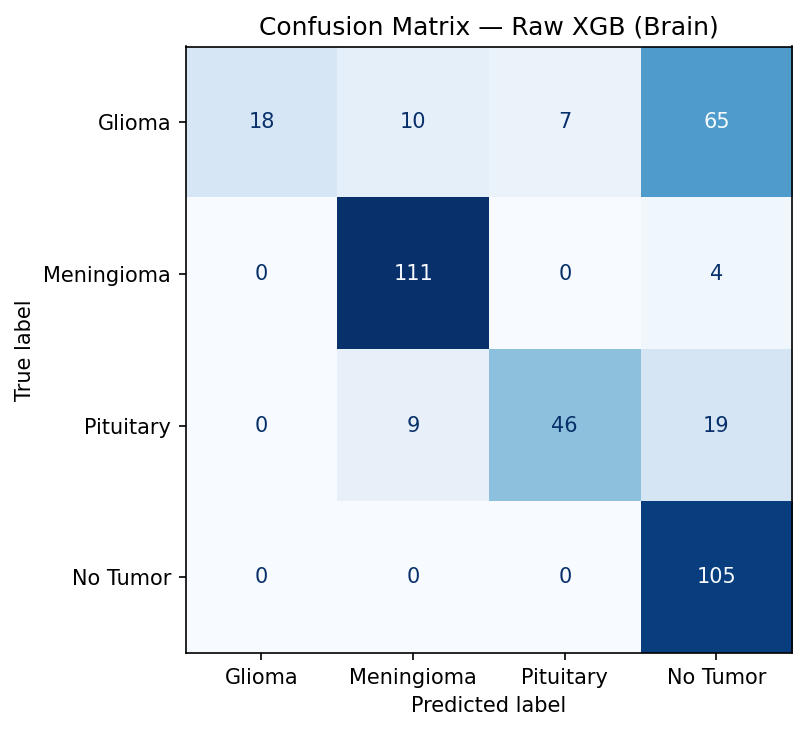
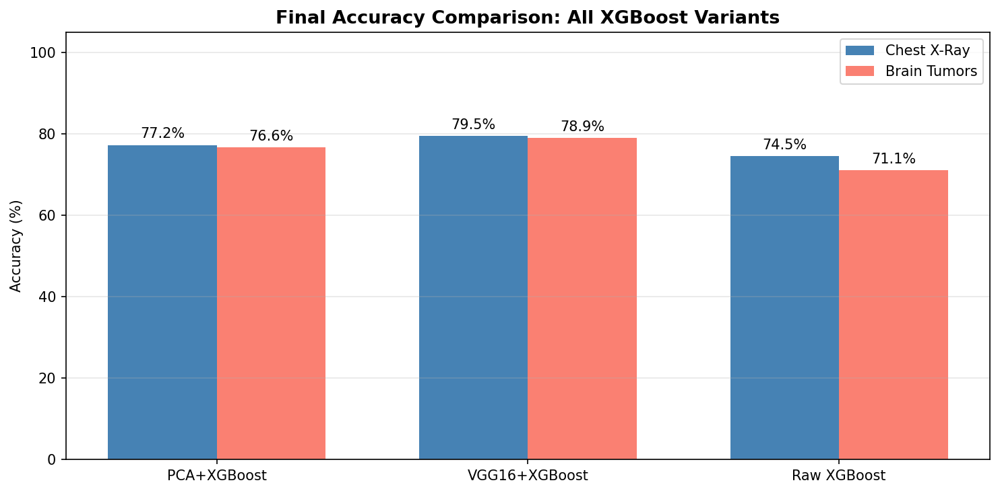
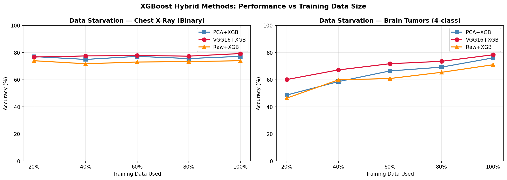

# XGBoost Hybrid Architectures for Medical Image Classification

Three XGBoost-based approaches are benchmarked against each other on two medical imaging datasets. The goal is to see how much the feature extraction strategy matters — raw pixels, PCA-compressed pixels, or deep features from VGG16.

This builds directly on the previous exercises:
- Exercise 1 used PCA + SVM. Here the SVM is swapped for XGBoost.
- Exercise 2 used VGG16 as a feature extractor for transfer learning. Here VGG16 is used to generate feature vectors that feed into XGBoost.

---

## Datasets

**Chest X-Ray (Pneumonia)** — Binary classification: NORMAL (0) vs PNEUMONIA (1)

| Split | NORMAL | PNEUMONIA | Total |
|:---|:---|:---|:---|
| Train | 1,341 | 3,875 | 5,216 |
| Test | 234 | 390 | 624 |

**Brain Tumor MRI** — 4-class: Glioma (0), Meningioma (1), Pituitary (2), No Tumor (3)

| Split | Glioma | Meningioma | Pituitary | No Tumor | Total |
|:---|:---|:---|:---|:---|:---|
| Train | 826 | 822 | 827 | 395 | 2,870 |
| Test | 100 | 115 | 74 | 105 | 394 |

Images are loaded at 150×150 grayscale for PCA and Raw XGBoost pipelines (22,500 features per image), and at 224×224 RGB for VGG16 feature extraction.

---

## Sample Images

**Chest X-Ray samples (NORMAL vs PNEUMONIA)**

**Brain Tumor MRI samples (all 4 classes)**

---

## Experiment 1 — PCA + XGBoost

PCA reduces the 22,500 pixel features down to 100 principal components, then XGBoost is trained on those compressed vectors.

- **Chest:** PCA retained 86.2% of variance in 100 components
- **Brain:** PCA retained 70.4% of variance in 100 components

Brain images are more visually diverse across classes, so PCA captures less of the relevant variation.

### Results

| Dataset | Accuracy | F1 | Sensitivity | Specificity |
|:---|:---|:---|:---|:---|
| Chest X-Ray | 77.24% | 0.7442 | 0.9872 | 0.4145 |
| Brain Tumor | 76.65% | 0.7181 | 0.7646 | 0.9211 |

The chest model has very high sensitivity (it rarely misses a pneumonia case) but poor specificity — it over-predicts pneumonia, which is partly a class imbalance effect (pneumonia outnumbers normal ~3:1 in the training set). The brain model is more balanced: 4 classes means no single class dominates.

### Confusion Matrices

| Chest | Brain |
|:---:|:---:|
|  |  |

---

## Experiment 2 — VGG16 + XGBoost

VGG16 (ImageNet weights, no top layers) is used as a frozen feature extractor. Each image is passed through VGG16 to produce a 25,088-dimensional feature vector (7×7×512 spatial output, flattened). XGBoost then trains on those vectors.

This is the most compute-intensive step — VGG16 extraction ran for ~365 seconds on the chest training set and ~313 seconds on brain. The features are extracted once and reused.

**Feature vector sizes:**

| Dataset | Train vectors | Test vectors |
|:---|:---|:---|
| Chest X-Ray | (4,341, 25,088) | (624, 25,088) |
| Brain Tumor | (2,870, 25,088) | (394, 25,088) |

### Results

| Dataset | Accuracy | F1 | Sensitivity | Specificity |
|:---|:---|:---|:---|:---|
| Chest X-Ray | 79.49% | 0.7732 | 0.9897 | 0.4701 |
| Brain Tumor | 78.93% | 0.7433 | 0.7905 | 0.9271 |

VGG16 + XGBoost is the top performer on both datasets. The specificity improvement on chest (from 0.4145 to 0.4701) shows that richer features help distinguish healthy patients better. On brain, both accuracy and F1 improve over PCA.

### Confusion Matrices

| Chest | Brain |
|:---:|:---:|
|  |  |

---

## Experiment 3 — Raw XGBoost (Baseline)

XGBoost is trained directly on the 22,500 raw pixel values with no preprocessing except normalisation. This is the baseline — no PCA, no neural feature extraction.

### Results

| Dataset | Accuracy | F1 | Sensitivity | Specificity |
|:---|:---|:---|:---|:---|
| Chest X-Ray | 74.52% | 0.7061 | 0.9872 | 0.3419 |
| Brain Tumor | 71.07% | 0.6658 | 0.6917 | 0.9014 |

Raw XGBoost is the weakest on both datasets. 22,500 noisy pixel features are hard for a tree-based model to handle without some form of dimensionality reduction or feature learning. The chest model still achieves high sensitivity (it detects pneumonia well), but specificity collapses — it calls almost everything pneumonia.

### Confusion Matrices

| Chest | Brain |
|:---:|:---:|
|  |  |

---

## Final Accuracy Comparison

| Dataset | PCA + XGBoost | VGG16 + XGBoost | Raw XGBoost |
|:---|:---|:---|:---|
| Chest X-Ray | 77.24% | **79.49%** | 74.52% |
| Brain Tumor | 76.65% | **78.93%** | 71.07% |

VGG16 + XGBoost leads on both. PCA + XGBoost is a reasonable middle ground with much lower compute cost. Raw XGBoost is consistently the floor.

---

## Experiment 4 — Data Starvation Study

Each method is retrained on 20%, 40%, 60%, 80%, and 100% of the available training data. The test set stays fixed. This shows how each method degrades as training data shrinks.

### Observations

**Chest X-Ray (binary)**

| Method | Trend |
|:---|:---|
| VGG16 + XGB | Stays relatively stable even at 20%. Pre-trained features carry most of the signal. |
| PCA + XGB | Drops noticeably below 40%, then recovers. PCA with very few samples loses useful variance. |
| Raw XGB | Degrades fastest. Raw pixel features are high-dimensional noise at small sample sizes. |

**Brain Tumor (4-class)**

| Method | Trend |
|:---|:---|
| VGG16 + XGB | Again the most robust. Holds accuracy better than the other two at every fraction. |
| PCA + XGB | Performance is more erratic — PCA explained only 70.4% of variance, so compressed features lose more context. |
| Raw XGB | The steepest drop going from 100% to 20%. Tree-based models overfit immediately on 22,500 raw features with few samples. |

The general pattern across both datasets: feature quality matters more than data quantity when data is scarce. VGG16 features require fewer training examples to generalise because the visual structure is already encoded from ImageNet training.

---

## Summary

| Method | Chest Acc | Brain Acc | Compute cost | Notes |
|:---|:---|:---|:---|:---|
| Raw XGBoost | 74.52% | 71.07% | Low | Weakest. Noisy pixel features. |
| PCA + XGBoost | 77.24% | 76.65% | Low–Medium | Good balance. 100 PCA components. |
| VGG16 + XGBoost | **79.49%** | **78.93%** | High | Best overall. Requires GPU or time for feature extraction. |

For limited medical data, VGG16 + XGBoost is the recommended approach. The pre-extracted features are rich enough that XGBoost can generalise even when training samples are restricted to 20% of the dataset.
